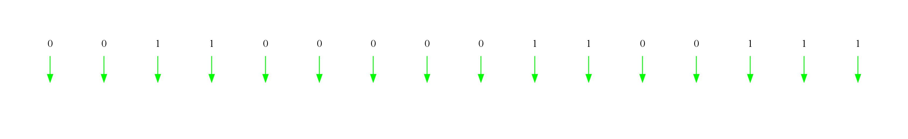
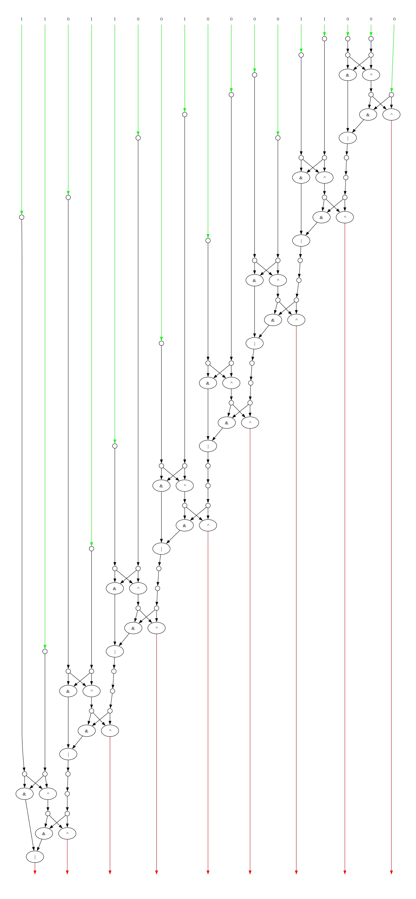
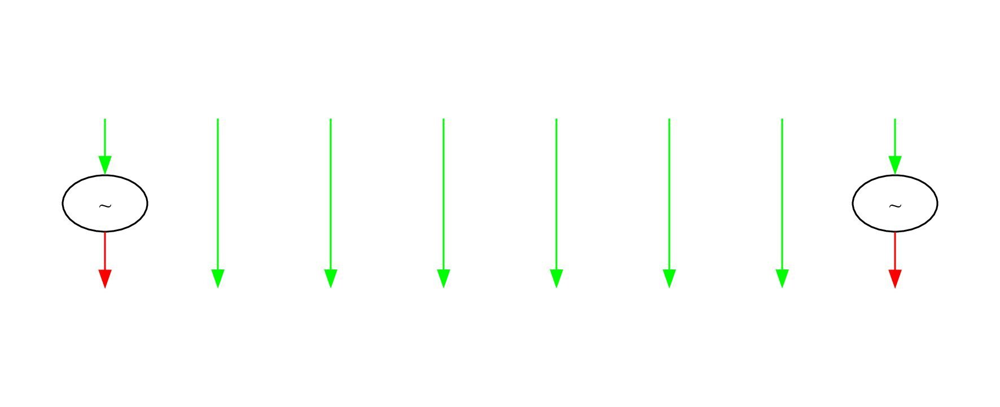
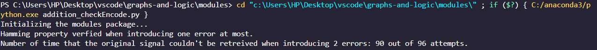
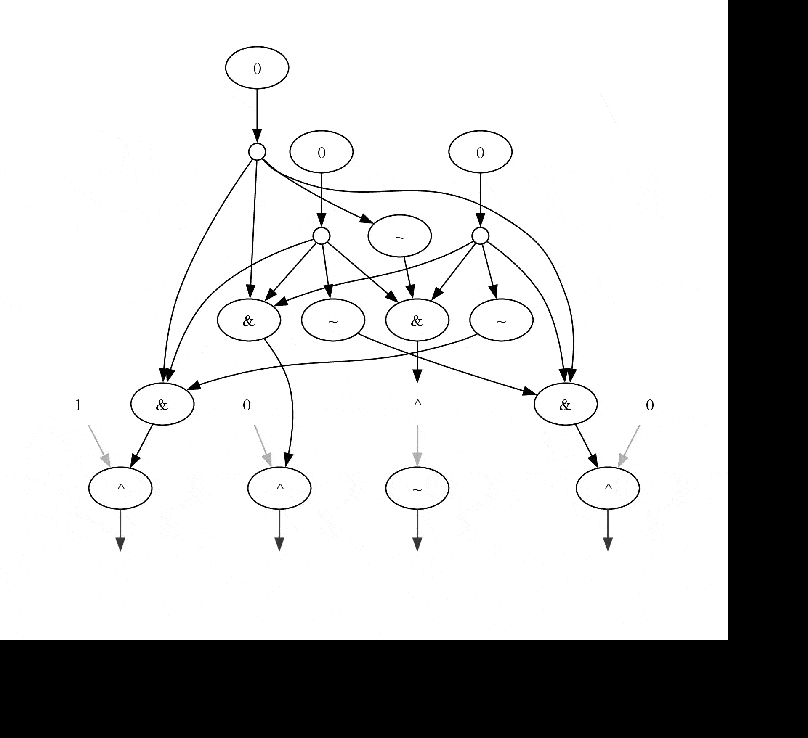
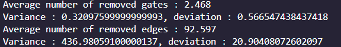

# Project Report: Boolean Circuits and Graph Operations

## Introduction
This project comprises several Python modules providing tools to work with boolean circuits, matrix operations, and open directed graphs (digraphs). Each module specializes in specific tasks like graph representation, node management, and circuit operations. This report offers a detailed overview of each module and its functions.

# Project Architecture

The project articulate itself around 3 main modules: **`node.py`** , **`open_digraph.py`** and **`bool_circ`** the latter two having been devided for readability using mixins as shown in the image below : 

<p>
The color <span style = "color: #ffb07c;"> peach</span> represents files that were generated using mixins from the main ones.
the color <span style = "color: #b29700;"> golden_light </span> are child classes that were added outside of the projects demands. We did this for better user experience. 
An arrow represents depending on the color either a dependence to another file (white with strips), mixins relation (black with strips) or heritage (black full line) on the of <code>circuit_node</code> and children.
</p>
<h2> Nodes </h2>
<p>
Starting from the basic elements of our graphs and boolean circuit, the class <code>node</code> implements all the basic methods of the first worksheets to manipulate them : getters, setters, calculating degrees etc. The class <code>circuit_node</code> is an <i>abstract class</i> as shown in the following code snippet:
</p>

```python
    class circuit_node(node):
    @classmethod
    def from_node(cls,node):
        """
        Creats the appropriate specialization of node
        from the node passed in parameter and returns it
        """

        @abstractmethod
        def transform(self,circuit):
            pass
```
<p>
All circuit_nodes meaning constants ,binary and unary gates are specializations of this class implementing the method <code>transform</code> that we will talk about more in details later. This addition allows us to write shorter methods in <code>boolean_circuits</code> and delegate some of the work when transfroming a circuit or evaluating it to the nodes themselves rather than doing everyting on the circuit level.
</p>

<h2>open_digraph</h2>
The implementation of this class was clearly directed during previous worksheets up until sheet 8 , we did not divert too much from that so there is not much to say that was not already specified in said sheets except that we added two files using mixins: <code>modules.open_digraph_paths_distance_mx.py</code> and <code>modules.open_digraph_composition_mx.py</code>. One contains all the methods of sheets 7 and 8 regarding path lengths and topological sort and the latter the methods for composing graphs (in parallel or sequence) which we heavily rely on later.

<h2>bool_circ</h2>
<p>
The main class for our study of boolean circuits. It contains class methods to create many of our circuits: <i>identity, encoders, decoders, registers, bit pertubators</i> as well as the main two methods that modify our circuits <code>transfrom , evaluate</code> which we will discuss in the approriate sections. The <code>adders</code> file contains all the methods related to creating adder circuits, be it <b>adders</b>, <b>half_adders</b> or <b>CLA adders</b>, as well as random boolean circuits.
</p>
<p>
The <code>modules.bool_circ_gates_mx.py</code> contains all the methods that implement the transformations used for either evaluating or transforming a circuit.
</p>
<p>
Lastly the <code>modules.addition_checkEncode.py</code> ,does not implement methods per say but many functions that practically use our circuits either for adding numbers of arbitrary size or checking the Hamming code property or displaying stats on the simplification of random circuits.
</p>


<h1>Transformation and evaluation</h1>
<p>
The methods <code>transform_circuit</code> and <code>evalaute</code> can get quickly complicated with many if statements to check if any recognizable configuration was found thus encouraging us to inroduce some heritage into the mix.
</p>
<h2> How they work </h2>
The blueprint is fairly the same for both as <code>evaluate</code> mainly transforms the circuit using new rules for constant nodes. The idea here is that the main code of both functions has two things to do: iterate over the nodes and know where it's done. When iterating it will call two methods respectively: <code>node.eval</code> and <code>node.transform</code> both of which are tasked to recognize any configuration where a transformation could be applied given the circuit.
<ul>
<li>For eval, this is done immediately in the node class because we iterate only over the constant nodes that wait for evalaution in <code>bool_circuit.evaluate</code>, no need to delegate to subclasses.

```python
def eval(self,circuit,outputs):
        
        #Neutral element management
        if (self.is_and() or self.is_or() or self.is_xor()) and len(self.parents)==0:
            circuit.neutral_element(self.id)
            res = [self.id]
        
        else:
            
            assert self.get_label() == "0" or self.get_label() == "1" 
            res = []
            node_id = self.get_id()
            child = list(self.get_children())[0]
            if child in circuit.get_outputs_ids():
                circuit.get_node_by_id(child).set_label(self.get_label())
                circuit.remove_node_by_id(node_id)
                outputs.remove(child)
            else:
                
                child_node = circuit.get_node_by_id(child)
                if child_node.is_and():
                    res = circuit.and_gate(child,node_id)
                elif child_node.is_or():
                    res = circuit.or_gate(child,node_id)
                elif child_node.is_xor():
                    res = circuit.xor_gate(child,node_id)
                elif child_node.is_not():
                    res = circuit.not_gate(child,node_id)
                elif child_node.is_copy():
                    res = circuit.copy_gate(child,node_id)
        
        return res
```
</li>
<li>For trasform, it's a bit trickier cause we iterate over and over on the graph until no transformation is possible and on many types of nodes thus we call <code>circuit_node.transfoom</code> delegating this work to every sub_class thus making the code more readable and modular.

```python
def transform(self, circuit):
        if self.is_copy():
            return circuit_node.from_node(self).transform(circuit)
        elif self.is_and():
            return circuit_node.from_node(self).transform(circuit)
        elif self.is_or():
            return circuit_node.from_node(self).transform(circuit)
        elif self.is_not():
            return circuit_node.from_node(self).transform(circuit)
        elif self.is_xor():
            return circuit_node.from_node(self).transform(circuit)
```
</li>
</ul>
Here's an exemple with <code>and_node</code> (the others follow the same pattern):

```python
def transform(self, circuit):
        r = False
        parents = list(self.get_parents())
        
        for p in parents:
            parent_node = circuit.get_node_by_id(p)
            if  parent_node.is_and():
                r=circuit.assoc_and(p,self.get_id())
        return r
```
<p>
And as you can see in the return statements, when finding a pattern we call the appropriate method that applies the transformation to the circuit and return a boolean if we did apply any, useful for knowing when to stop.
</p>
With all this out of the way we can get into answering our questions.
<h1>Half Adder evaluation</h1>

<p>Addition of 162 and 210</p>
<p>
The half adder has been defined following the sheet 10 implementation thus we have first implemented an <code>adder(0)</code> that we recursively build up on to add more and more bits always making sure that the carry bit is transferred to the next one.
Here's the code snippet for the recursion part : 

```python
    if n == 0
        #create adder(0) and return it
    else:
        adder_1,carry_in1,carry_out1 = cls.adder_helper(n-1)
        adder_2,carry_in2,carry_out2 = cls.adder_helper(n-1)
        n = adder_1.iparallel(adder_2)
        adder_1.add_edge(carry_out1+n,carry_in2)
        adder_1.get_inputs_ids().remove(carry_in2)
        adder_1.get_outputs_ids().remove(carry_out1+n)
        return adder_1,carry_in1+n,carry_out2
```
The half_adder is then easily implemented after that. For practical use, we have a **class method** <code>bool_circ.create_registre(cls,acc ,size=8)</code> that converts *acc* to binary and loads it inside a circuit representing the identity, giving us the possibility to compose it with any circuit of the adequate inputs number and that's what we do in our addition function.
</p>

Here's what we get after loading it a half_adder

Note that the bit order might seem off (and a bit hard to read otherwise the image would be too large) and that's normal because our adders (except the CLA) load the bits by weight (an bn , ..., a0 b0).

<h2>Half_adder and CLA_adder comparison</h2>

#### Comparison
- Half_adder 
    - depth half_adder(n) = 5*2^n+1
    - number of gates half_adder(n) = 14*2^n 
    - number of outputs half_adder(n) = 1 + 2^n
    - number of inputs half_adder(n) = 2^(n+1) (+1 if counting the fixed 0)

- CLA_adder
    - depth CLA_adder(n) = 11 + 9*n
    - number of gates CLA_adder(n) = 79*(n+1)
    - number of outputs CLA_adder(n) = 1 + 4*(n+1)
    - number of inputs CLA_adder(n) = 1 + 8*(n+1)

<div style = 'display:flex;'>

<p>
We can clearly see the advantages of each compared to the other: with the half_adder, 
very large numbers can be added with a fairly small number n in a half_adder(n).
For example, half_adder(10) can add 1024-bit numbers together, while this would take
a CLA_adder(255) to do. 
With the CLA_adder, we can add numbers faster than with half_adder, at the cost of having more
nodes. For example, to add 32-bits integer, CLA_adder(7) does the job with a depth of 74 while
half_adder(5) does the job with a depth of 161, more than double the depth and with medium sized integers!
</p>

</div>

#### Shortest distances

For the shortest distance between an input and an output, we programmed the function:
```python
    def shortest_path_input_output(n, half_):
        if (half_):
            g = adders.half_adder(n)[0]
        else :
            g = adders.CLA_adder(n)
        
        smallest_dist = sys.maxsize
        input_id = -1
        output_id = -1
        for i in g.get_inputs_ids():
            for j in g.get_outputs_ids():
                dist = g.shortest_path(i,j)
                if dist<smallest_dist:
                    smallest_dist = dist
                    input_id = i
                    output_id = j
        #g.display_graph("test",verbose = True)
        return smallest_dist,input_id,output_id
```
which returns the input_id and output_id that represents the input and the output that are the closest (have the shortest distance) and the distance itself.

We notice that the input and output that have the shortest distance is always the carry in bit with the c0 output which would be the output furthest to the right in the graphs representations. 

This makes sense as this would be the shortest path for Half_adder(0) and CLA_adder(0) and adding anything else would have larger distances since the carry of the added circuits won't be an input anymore and anything would have a minimum distance to an output >=3

<h2>Hamming code and perturbations</h2>
<p>
For this verfication of the Hamming code property we have implemented as suggested in worksheet 12 two methods <code>encodeur_4bits()</code> and  <code>decodeur_7bits</code> that implement the respective circuits. We also added a method that creates perturbations <code>bool_circ.perturb_bit(cls,n,list_pos)</code> that takes the number of inputs/ouputs and a list of positions in {0,...,n-1} and inverts said bits, here's how it looks like: 
</p>

You can see here that we perturbated the first and last bit given in entry, we will be using this the same way as we use register.For our experiment we will compose in this order:  decodeur o perturb_bit o encodeur(sigal). Resulting in the following protocol:

```python
    def check_invarients():
    enc = adders.encodeur_4bits()
    dec = adders.decodeur_7bits()
    
    for i in range(-1,4): #-1 -> no error is introduced
        noise = adders.perturbe_bit(7,[i]) 
        g = adders(noise.compose(enc))
        g2 = adders(dec.compose(g))
        
        for i in range(10,11):
            reg = adders.create_registre(i,size=4)
            g3 = adders(g2.compose(reg))
            assert (i==g3.calculate())
    
    print("Hamming property verfied when introducing one error at most.")
    
    mistakes = 0
    for i in range(0,4): 
        for j in range(i+1,4):
            noise = adders.perturbe_bit(7,[i,j]) 
            g = adders(noise.compose(enc))
            g2 = adders(dec.compose(g))
            for k in range(0,16):
                reg = adders.create_registre(k,size=4)
                g3 = adders(g2.compose(reg))
                mistakes += (i!=g3.calculate())
    print(f"Number of time that the original signal couldn't be retreived when introducing 2 errors: {mistakes} out of {6*16} attempts.")
```
<p>
Since we are restraining oursevles to 4 bits making sure that we get the same output as our input for number ranging from 0 to 15 is enough to state if the hamming propery was conserved or not.
</p>
<p>
The second part of the code introduces another perturbation at a diffrent bit from the first and count how many mistakes were made i.e how many times we couldnt retreive the message, here's the result of executing this code:

And the evaluation associated to it with one perturbation:

</p>


<h2>Circuit Simplification</h2>

<p> Beside the transformations that were given in the last two worksheets we have implemented some more operations to simplify boolean circuits, those being: associativity for <b>and</b> ,  <b>or</b> on the same patter and xor's associativity as well as idempotance s for these two gates:
<code>A+A = A and A.A = A</code> which is somewhat analogous to the xor's involution, we also addded absorbtion for both of these gates as well:
<ul>
<li>A.(A+B) = A</li>
<li>A+(A.B) = A</li>
</ul>
Where . is the and gate and + the or.Adding more transformation heavily impacted the complexity of <code>transform</code> so we decided to stick to thsese,(these already forces us to check all the children of copy nodes another time and it just gets worse with other simplifications).With these new additions and the previous transformations we went ahead and tried to judge just how well our transform function performs. To do so we will test our code on a large number of randomly generated boolean_circuits and we will calculate the number of gates and edges that we suppressed using our transform function.Here's the function that illustrates the protocole with the result of the execution:

```python
def print_stats():
    diff_nodes = 0
    diff_edges = 0
    vn = 0
    ve = 0
    number_trials = 1000

    for i in range(number_trials):
        inputs = random.choice([8,16,32,64])
        outputs = random.choice([8,16,32,64])
        node_number = inputs + outputs + random.randint(32, 128)
        circuit = bool_circ.random_circ_bool(node_number, inputs, outputs)
        node_number = len(circuit.get_nodes())
        edges_number = count_edges(circuit)
        
        circuit.transform_circuit()
        
        number_left_nodes = len(circuit.get_nodes())
        edges_left = count_edges(circuit)
        
        diff_nodes += node_number - number_left_nodes
        diff_edges += edges_number - edges_left
        
        vn += (node_number - number_left_nodes)**2
        ve += (edges_number - edges_left)**2

    moy_n = diff_nodes / number_trials
    moy_e = diff_edges / number_trials

    var_n = vn / number_trials - moy_n**2
    var_e = ve / number_trials - moy_e**2

    print(f"Moyenne de Portes éliminées: {moy_n}")
    print(f"Variance de Portes éliminées: {var_n}, écart type: {np.sqrt(var_n)}")
    print(f"Moyenne d'arêtes éliminées: {moy_e}")
    print(f"Variance d'arêtes éliminées: {var_e}, écart type: {np.sqrt(var_e)}")
```

</p>


## Conclusion
This project provides a wide range of tools for working with boolean circuits, matrix operations, and open directed graphs. Each module is carefully designed to encapsulate key computational operations, allowing for efficient manipulation and analysis of these data structures. Further development in optimization and implementation of more graph algorithms and more circuit gates could expand the project's reach and applicability.


## Appendix


## Modules Overview and Key Functions

For reference, this photo of a class diagram shows the dependencies between the files and therefore its organisation.

### `__init__.py`
This file acts as an initializer for the package, but it does not contain any custom functions or classes.

### `bool_circ.py`
This module focuses on boolean circuits and contains the following functions:

1. **`__init__`**  
   Initializes the `bool_circ` class, setting up the circuit's internal data structures.

2. **`is_well_formed`**  
   Validates whether the current boolean circuit is well-formed.

3. **`insert_node`**  
   Inserts a new node into the circuit at a specified location.

4. **`identity`**  
    Checks if two boolean circuits are identical.

5. **`parse_parentheses`**  
    Parses a circuit defined with parentheses notation into a boolean circuit object.

6. **`random_circ_bool`**  
    Generates a random boolean circuit with the specified number of nodes.

7. **`create_registre`**  
    Creates a register with the specified configuration.

8. **`evaluate`**  
    Evaluates the boolean circuit and returns the logical output.

9. **`encodeur_4bits`**  
    Implements a 4-bit encoder circuit.

10. **`decodeur_7bits`**  
    Implements a 7-bit decoder circuit.

11. **`transform_circuit`**  
    Transforms the boolean circuit into another logical representation.

12. **`calculate`**  
    Computes logical results based on the circuit's nodes.

13. **`perturbe_bit`**  
    Randomly perturbs a single bit in a logical 
    circuit.

14. **`convert_to_binary_string`**  
    Converts the circuit's results to a binary string.

### `bool_circ_gates_max.py`

1. **`copy_gate`**  
    Implements a "copy" logical gate.

2. **`not_gate`**  
    Implements a "NOT" logical gate.

3. **`and_gate`**  
    Implements an "AND" logical gate.

4. **`or_gate`**  
    Implements an "OR" logical gate.

5. **`xor_gate`**  
    Implements an "XOR" logical gate.

6. **`neutral_element`**  
    Returns a circuit with a neutral element.

7. **`assoc_xor`**  
    Checks the associativity of XOR logical gates.

8. **`assoc_copy`**  
    Checks the associativity of copy logical gates.

9. **`involution_xor`**  
    Checks the involution property of XOR logical gates.

10. **`effacement`**  
    Validates the logical circuit's effacement.

11. **`not_xor`**  
    Validates if NOT and XOR logical gates satisfy specific logical constraints.

12. **`not_copy`**  
    Checks specific logical constraints involving NOT and copy logical gates.

13. **`involution_not`**  
    Validates the involution property of NOT logical gates.

#### `Bonus transformations`

14. **`assoc_and`**  
    Checks the associativity of AND logical gates.

15. **`assoc_or`**  
    Checks the associativity of OR logical gates.

16. **`idempotance_and`**
        Applies the idempotence property to an AND gate.

17. **`idempotance_or`**
        Applies the idempotence property to an OR gate.

18. **`absoroption_and`**
        Resolves an AND gate by absorbing the copy and OR gates.

19. **`absoroption_or`**
        Resolves an OR gate by absorbing the copy and AND gates.

### `addition_checkEncode.py`

The `addition_checkEncode.py` module focuses on checking the equivalence of addition circuits. The functions are described below.

1. **`find_bigger_2_pow`**  
   Finds the smallest power of 2 greater than a given number.

2. **`add_registre_CLA`**  
   Adds two numbers using a Carry-Lookahead Adder (CLA) method.

3. **`add_CLA`**  
   Adds two numbers without specifying a size using the CLA method.

4. **`add_registre_naive`**  
   Adds two numbers using a naive method.

5. **`add_registre_naive_half`**  
   Adds two numbers using a half-adder.

6. **`add_naive`**  
   Adds two numbers without specifying a size using the naive method.

7. **`check_invarients`**  
   Verifies that specific invariants are maintained.

8. **`count_edges`**  
   Counts the number of edges in a circuit.

9. **`print_stats`**  
   Prints statistical information on removed nodes and edges.

10. **`shortest_path_input_output`**  
   Finds the shortest path between an input and an output in either a half-adder or CLA adder.


### `matrix_operations.py`
This module provides various matrix operations and contains the following functions:

1. **`random_int_list`**  
   Generates a list of random integers.

2. **`random_int_matrix`**  
   Generates a random matrix of integers.

3. **`random_symetric_int_matrix`**  
   Generates a random symmetric matrix of integers.

4. **`random_oriented_int_matrix`**  
   Generates a random oriented matrix of integers.

5. **`random_dag_int_matrix`**  
   Generates a random directed acyclic graph (DAG) matrix.

6. **`print_m`**  
   Prints the given matrix in a human-readable format.

7. **`identity_matrix`**  
   Creates an identity matrix of the given size.

8. **`copy_matrix`**  
   Returns a copy of the given matrix.

9. **`degree_matrix`**  
   Computes the degree matrix for the given adjacency matrix.

10. **`laplacian`**  
    Computes the Laplacian matrix for the given adjacency matrix.

11. **`swap_rows`**  
    Swaps two rows in the given matrix.

12. **`scale_row`**  
    Scales a row in the matrix by a specified factor.

13. **`add_scaled_row`**  
    Adds a scaled version of one row to another in the given matrix.

14. **`gauss`**  
    Applies Gaussian elimination to the given matrix.

15. **`rank`**  
    Calculates the rank of the given matrix.

16. **`kernel_dim`**  
    Determines the dimension of the kernel of the given matrix.

### `node.py`
This module manages nodes within graphs, circuits, and other structures. It contains several classes and functions:

#### Classes
- **`copy_node` Class**  
  Represents a copy node in a graph structure.

- **`and_node` Class**  
  Represents an AND node in a graph structure.

- **`or_node` Class**  
  Represents an OR node in a graph structure.

- **`not_node` Class**  
  Represents a NOT node in a graph structure.

- **`xor_node` Class**  
  Represents an XOR node in a graph structure.

- **`constant_node` Class**  
  Represents a constant node in a graph structure.

#### Functions

1. **`__init__`**  
   Initializes a node with an ID, label, and optional lists of input and output edges.

2. **`copy`**  
   Creates a copy of the node.

3. **`indegree`**  
   Calculates the indegree (number of incoming edges) of a node.

4. **`outdegree`**  
   Calculates the outdegree (number of outgoing edges) of a node.

5. **`degree`**  
   Calculates the total degree (sum of indegree and outdegree) of a node.

6. **`is_copy`**  
   Determines if the node is a copy node.

7. **`is_or`**  
   Determines if the node is an OR node.

8. **`is_and`**  
   Determines if the node is an AND node.

9. **`is_not`**  
   Determines if the node is a NOT node.

10. **`is_xor`**  
    Determines if the node is an XOR node.

11. **`is_constant`**  
    Determines if the node is a constant node.

12. **`transform`**  
    Applies a transformation to the node.

### `open_digraph.py`
This module manages open directed graphs and contains the following functions and classes:

#### Classes
- **`open_digraph` Class**  
  Represents an open directed graph with nodes and edges.

#### Functions

1. **`graph_from_adjacency_matrix`**  
   Creates a graph based on the given adjacency matrix.

2. **`is_well_formed`**  
    Checks whether the graph is well-formed.

3. **`adjacency_matrix`**  
    Returns the adjacency matrix representation of the graph.

4. **`random`**  
    Generates a random graph based on the given parameters.

5. **`save_as_dot_file`**  
    Saves the graph in the DOT format.

6. **`display_graph`**  
    Displays the graph using Graphviz.

7. **`from_dot_file`**  
    Loads a graph from a DOT file.

8. **`is_acyclic`**  
    Determines if the graph is acyclic.

9. **`identity`**  
    Returns an identity graph.

10. **`component_list`**  
    Returns a list of all components in the graph.

11. **`merge_nodes`**  
    Merges two or more nodes into one.

### `open_digraph_composition_mx.py`
This module focuses on matrix representations for graph composition operations and contains the following functions:

1. **`min_id`**  
   Returns the minimum node ID in the graph.

2. **`max_id`**  
   Returns the maximum node ID in the graph.

3. **`shift_indices`**  
   Shifts the indices of all nodes in the graph by a specified amount.

4. **`shift_keys`**  
   Shifts the keys of all nodes in the graph's data structure.

5. **`iparallel`**  
   Performs an in-place parallel composition of two graphs.

6. **`parallel`**  
   Returns a parallel composition of two graphs.

7. **`icompose`**  
   Performs an in-place composition of two graphs.

8. **`compose`**  
   Returns a composition of two graphs.

9. **`connected_components`**  
   Returns the connected components of a graph.


### `open_digraph_paths_distance_mx.py`
This module handles path and distance calculations using matrix operations and contains the following functions:

1. **`dijkstra`**  
   Finds the shortest path from a source node to all other nodes using Dijkstra's algorithm.

2. **`shortest_path`**  
   Returns the shortest path between two nodes.

3. **`topological_sort`**  
   Arranges nodes in topological order in a directed acyclic graph.

4. **`depth_node_acyclic_knowing_Topological_sort`**  
   Returns the depth of a node, assuming the graph is sorted topologically.

5. **`depth_node_acyclic`**  
   Calculates the depth of a node in an acyclic graph.

6. **`depth_acyclic`**  
   Computes the depth of an acyclic graph.

7. **`longest_path`**  
   Determines the longest path between two nodes in a directed acyclic graph.


### `adders.py`

The `adders.py` module contains various functions to create different types of adder circuits. The key functions are described below.

1. **`adder_helper`**  
   An auxiliary function that assists in creating the adder recursively based on the desired level.

2. **`adder`**  
   Uses the `adder_helper` function to create an adder circuit.

3. **`half_adder`**  
   Uses `adder_helper` to create a half-adder circuit.

4. **`CL_4bit`**  
   Creates the circuit representing the `pn` and `gn` algebraic expressions.

5. **`CLA_4bit`**  
   Creates the circuit representing a 4-bit CLA adder.

6. **`CLA_helper`**  
   An auxiliary function that helps in creating the CLA adder recursively.

7. **`CLA_adder`**  
   Creates a CLA adder circuit.

